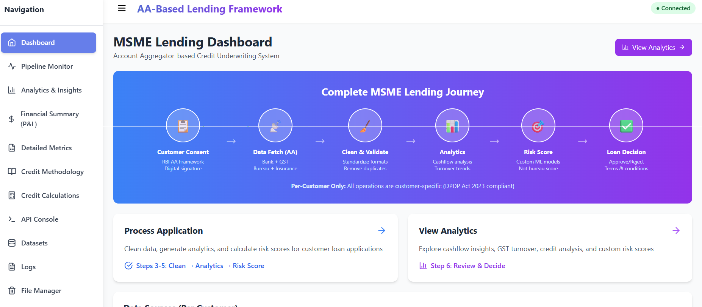
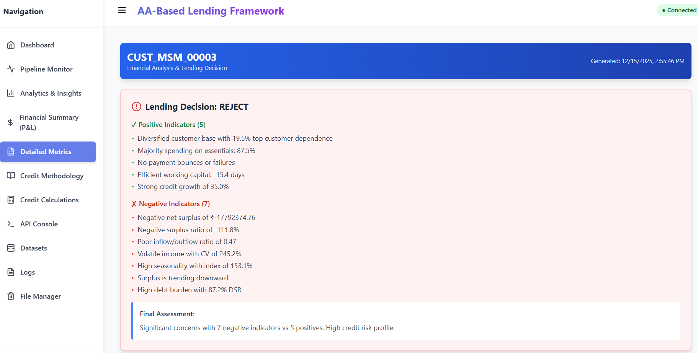
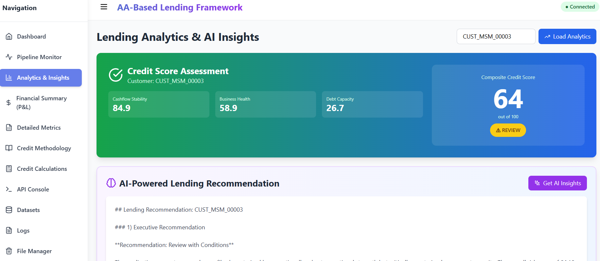
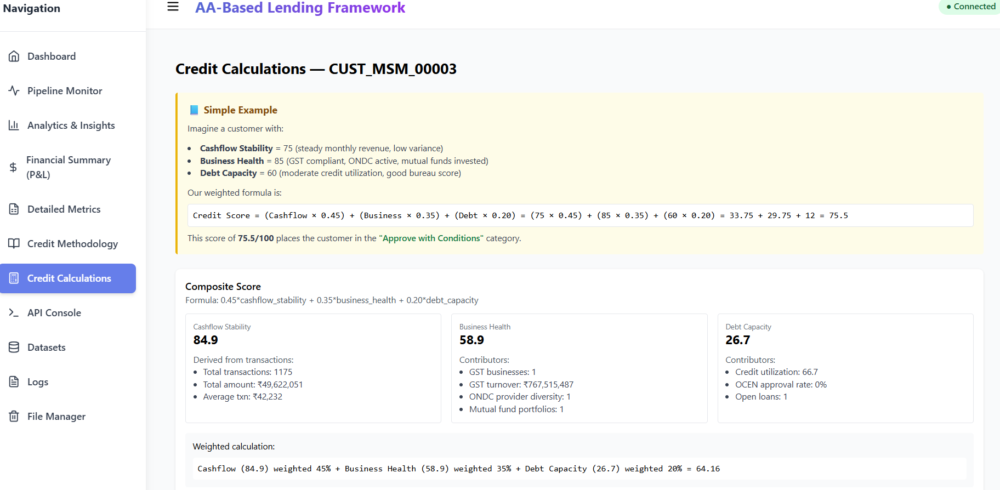
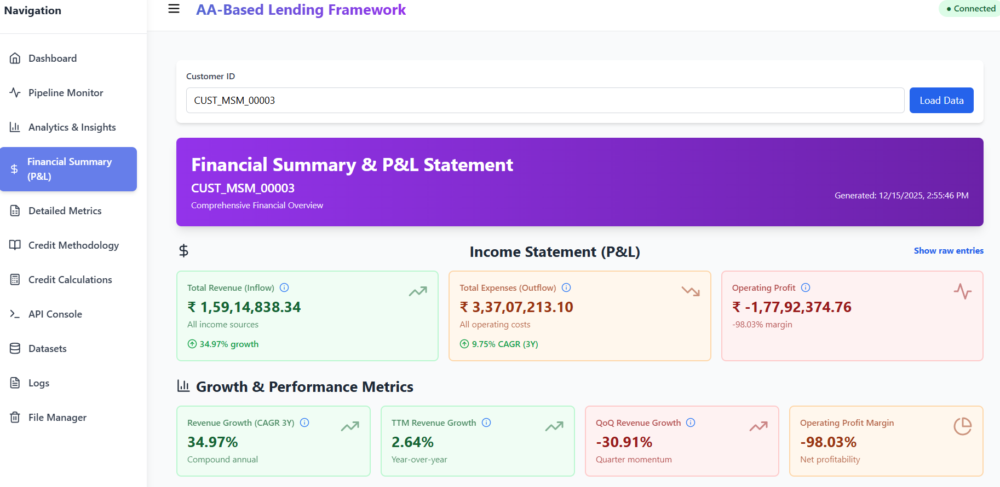

# MSME Lending Platform - Indian Financial Data Lake

A compliance-first, developer-friendly platform that unifies Indian financial signals to deliver faster, explainable, and auditable MSME credit decisions.

Top USPs
- **Multi-source aggregation**: unified view across banking, GST, insurance, mutual funds, ONDC and OCEN.
- **Consent-first & auditable**: per-customer scoping aligned with DPDP 2023 and RBI AA principles.
- **Explainable scoring**: transparent, formula-backed credit calculations with per-metric breakdowns.
- **Reproducible demos**: deterministic synthetic generators for stable, shareable demo datasets.

Top features
- Reproducible synthetic customer datasets for repeatable demos
- End-to-end pipeline: generate → clean → analyze → score
- Lightweight API + React dashboard for live demos and debugging
- AI-assisted insights with graceful provider fallback

## Screenshots

Note: Screenshots are stored in the `docs/screenshots/` directory.

### Dashboard Overview


### Analytics & Insights


### Credit Scoring & Calculations



### Financial Summary


### Pipeline Monitor


---

## Problem Statement

**Challenge**: Traditional MSME lending in India faces critical barriers:
- Manual, paper-heavy credit assessment leads to weeks-long approval cycles
- Single-source bureau scores (CIBIL) miss 70% of the real financial picture
- No unified view of banking, GST, insurance, mutual funds, ONDC, OCEN data
- DPDP Act 2023 mandates explicit per-customer consent — bulk data operations prohibited
- RBI Account Aggregator Framework requires standardized multi-FIP data fetching

**Business Impact**:
- High average loan turnaround for MSMEs
- High rejection rate due to incomplete financial visibility
- Manual underwriting prone to bias and errors
- Cannot scale to millions of MSME borrowers

---

## Proposed Solution

A comprehensive MSME credit decisioning platform leveraging:

### 1. Account Aggregator (AA) Framework Integration
- One Borrower → One Consent → One Dataset
- Compliant with RBI AA specs and DPDP Act 2023
- Fetch multi-source financial data: Banking, GST, Bureau, Insurance, MF, ONDC, OCEN

### 2. Multi-Source Analytics
- 7 data sources aggregated per customer (vs. traditional 1-2)
- Automated cashflow analysis, GST compliance scoring, anomaly detection
- **Enhanced Composite Credit Scoring** (0-100 scale):
  - **Cashflow Stability (45% weight)**:
    - Surplus Ratio (0-15 points): Measures net surplus as % of revenue
    - Income Stability CV (0-15 points): Lower CV = more stable income
    - Seasonality Index (0-15 points): Extreme seasonality penalized
  - **Business Health (35% weight)**:
    - GST Compliance (0-10 points): Return filing regularity
    - Revenue Growth (0-15 points): YoY and QoQ growth trends
    - Working Capital (0-10 points): Positive gap indicates healthy liquidity
  - **Debt Capacity (20% weight)**:
    - Credit Score Component (0-10 points): Based on default probability
    - DTI Impact (0-5 points): Lower debt-to-income = better capacity
    - OCEN Approval (0-3 points): Loan application approval rate
    - Payment Regularity (0-2 points): Consistent payment history
- **Enhanced Detection Patterns**:
  - 11 bounce keywords: BOUNCE, BOUNCED, FAILED, FAILURE, REJECT, REJECTED, INSUFFICIENT, RETURN, RETURNED, DISHONOUR, DISHONORED
  - 5 EMI keywords: EMI, E.M.I, EQUATED, INSTALLMENT, INSTALMENT
  - 8+ loan keywords: LOAN, TERM LOAN, BUSINESS LOAN, PERSONAL LOAN, HOME LOAN, etc.
  - Category-based detection: LOAN_REPAYMENT category automatically flagged

### 3. Explainable AI & Transparency
- **Interactive Metric Exploration**: Click any ℹ️ button to see:
  - Mathematical formula used for calculation
  - Step-by-step breakdown with actual customer values
  - Risk interpretation and business impact
  - Sample transactions where applicable
- **Separate Methodology Tab**: Complete documentation of:
  - Composite scoring formula derivation
  - Weight allocation rationale (45% Cashflow, 35% Business Health, 20% Debt Capacity)
  - Risk thresholds: Approve (≥75), Review (60-74), Caution (<60)
- **Credit Calculations Tab**: Per-customer numeric walkthrough:
  - Shows actual values from customer analytics
  - Simple arithmetic demonstrating score derivation
  - Component-wise contribution to final score
- **Debug Panels**: Collapsible raw data inspectors in charts
- **Sample Transaction Modals**: 
  - Top 10 expense transactions with amounts and dates
  - Failed/bounced transactions for credit analysis
  - EMI transactions for debt service calculations
  - Unknown/uncategorized transactions for manual review

### 4. Pre-loaded Demo Datasets for Quick Demonstration
- 10 customer profiles with varying risk levels and specialized behaviors
- Range from excellent borrowers to high-risk cases with edge scenarios
- Profiles include: High Seasonality, High Debt, Growing Business, Declining Business, etc.
- See `data_lake/docs/CUSTOMER_PROFILES.md` for detailed descriptions

---

## Implementation

### Demo Flow (Current Setup)

**Pre-loaded Datasets**: 10 customer profiles (CUST_MSM_00001 through CUST_MSM_00010) are already generated and stored in `data_lake/raw/`. Each represents different lending scenarios.

**Pipeline Flow**:
```
Customer Selection (choose from 00001-00010)
         ↓
Step 1: Consent Validation (simulated AA consent check)
         ↓
Step 2: Clean & Validate Data (remove outliers, standardize formats)
         ↓
Step 3: Generate Analytics (calculate 7-source summaries + earnings/spendings)
         ↓
Step 4: Calculate Credit Score (composite weighted score + AI insights)
         ↓
Lending Decision (Approve / Review / Reject)
         
      Note: The profile generator and analytics pipeline are month-aware — stable-income profiles now normalize monthly credit totals (targeting ±0.5% month-to-month variability) and growth/decline profiles apply month-wise multipliers to produce clear positive or negative trends. EMI and bounce profiles inject explicit transactions (EMIs/FAILED) rather than only mutating existing items to improve detectability.
```

### Architecture

```
┌─────────────────┐
│  10 Pre-loaded  │  Demo Customer Datasets
│  Customer       │  (CUST_MSM_00001 - CUST_MSM_00010)
│  Profiles       │  Different risk profiles: seasonal, high-debt, growth, stable, etc.
└─────────────────┘
         │
         ▼
┌──────────────────────────────────────────────────────┐
│  Simulated AA Data (stored in data_lake/raw/)        │
│  • Banking (Accounts & Transactions)                 │
│  • GST (GSTR-1, GSTR-3B with monthly aggregation)    │
│  • Credit Bureau (CIBIL/Experian-style reports)      │
│  • Insurance (Life, Health, Vehicle policies)        │
│  • Mutual Funds (AMC holdings, SIPs)                 │
│  • ONDC (Beckn protocol orders)                      │
│  • OCEN (loan applications)                          │
└──────────────────────────────────────────────────────┘
                     │
                     ▼
┌──────────────────────────────────────────────────────┐
│  Data Pipeline (per-customer)                        │
│  1. Clean & Validate (schemas + error logs)          │
│  2. Generate Analytics (7 summaries + overall)       │
│  3. AI Insights (Deepseek/Gemini - lending reco)     │
│  4. Calculate Credit Score (composite weighted)      │
└──────────────────────────────────────────────────────┘
                     │
                     ▼
┌──────────────────────────────────────────────────────┐
│  Frontend Dashboard                                  │
│  • Lending Analytics & AI Insights (main view)       │
│  • Earnings vs Spendings (detailed financial health) │
│  • Credit Methodology (explainability doc)           │
│  • Credit Calculations (numeric examples)            │
│  • Pipeline Monitor (real-time progress)             │
│  • Dataset Viewer (raw/clean data inspection)        │
└──────────────────────────────────────────────────────┘
```

### Technology Stack

**Backend**:
- Python 3.11+ (Flask, SocketIO)
- NDJSON for raw/clean data storage
- JSON for analytics summaries
- AI providers: Deepseek (primary), Google Gemini (fallback)

**Frontend**:
- React 18, Tailwind CSS
- Recharts for visualizations
- Axios for API calls
- WebSocket (Socket.IO client) for pipeline updates

**Data Generation**:
- Realistic Indian data patterns (PAN, GSTIN, IFSC, mobile, addresses)
- Per-customer seeding (hash of customer_id → unique deterministic data)
- Configurable messiness (date format variation, missing fields, duplicates)
- Specialized profile modifications (seasonality, debt, growth patterns)
  - Month-aware profile modifications: stable income normalizes monthly totals, growth/decline apply month-wise multipliers, and explicit transaction injection is used for EMI/bounce/concentration profiles to ensure detectability in analytics

---

## Features Implemented

### Data Sources (Per Customer)
1. **Consent Artefacts** — RBI AA Framework digital consent
2. **Banking** — 2-5 accounts, 50,000 transactions (multiple years)
3. **GST Returns** — 5,000 returns with monthly aggregation to prevent inflation
4. **Credit Bureau** — 843 credit report entries with simulated bureau scores
5. **Insurance** — 0-1,000 policies (Life, Health, Vehicle)
6. **Mutual Funds** — 0-425 portfolios (AMC, SIPs)
7. **ONDC Orders** — 100-1,903 orders (Beckn protocol, for sellers)
8. **OCEN Applications** — 10-272 loan applications

### Analytics Engine
- **Overall Summary** — composite score + methodology with business health calculation
- **Transaction Summary** — cashflow, income/expense, inflow/outflow ratios
- **Earnings vs Spendings** — comprehensive financial analysis with 30+ metrics:
  - **Cashflow Metrics**: Inflow/Outflow Ratio, Net Surplus, Surplus Ratio, Income Stability CV, Seasonality Index
  - **Growth Metrics**: Credit Growth Rate, TTM Revenue Growth, QoQ Revenue Growth, Expense Growth Rate, Profit Margin
  - **Credit Scores**: Bounce Count, EMI Consistency, Credit Utilization Ratio, Default Probability Score, Debt-to-Income Ratio, Payment Regularity Score, Loan Repayment Rate
  - **Business Health**: GST vs Bank Reconciliation, Working Capital Gap (days), Annual Operating Cashflow
  - **All metrics include**: Formula, Breakdown with actual dataset values, Risk interpretation
- **GST Summary** — turnover (monthly aggregated to prevent inflation), returns count, state distribution
- **Credit Summary** — bureau score, utilization, open loans
- **Anomaly Detection** — high-value transactions, unusual patterns
- **Mutual Funds Summary** — invested amount, returns, portfolios
- **Insurance Summary** — total coverage, premium paid, policies
- **ONDC Summary** — order volume, provider diversity, category breakdown
- **OCEN Summary** — application count, approval rates, loan amounts

### Frontend Dashboard

The application features 11 comprehensive tabs for complete financial analysis:

1. **Dashboard** — System overview and quick stats

2. **Pipeline Monitor** — Real-time data generation and processing:
   - On-demand customer generation with random ID generator
   - 4-step pipeline execution with live progress tracking
   - Real-time execution debugging showing current command
   - Collapsible debug panel with color-coded logs (error/warning/success/info)
   - Specialized customer profile selection (High Seasonality, High Debt, Growth, etc.)

3. **Analytics & Insights** — Main lending dashboard:
   - Prominent credit score display with click-to-expand component derivations
   - Transaction, GST, ONDC, Mutual Funds, Insurance, OCEN, Anomaly cards
   - Debug panel in GST section (collapsible raw data inspector)
   - AI-generated lending recommendation (Deepseek/Gemini with auto-fallback)
   - Enter key submit on customer ID input

4. **Financial Summary (P&L)** — Comprehensive profit & loss statement:
   - Total Revenue, Total Expenses, Operating Profit with detailed calculations
   - Click any metric to see: Formula, Breakdown with actual values, Explanation
   - Top 10 expense categories with sample transactions
   - Unknown transactions identification and categorization
   - All values with ₹ formatting and thousand separators

5. **Detailed Metrics (Earnings vs Spendings)** — 30+ financial health indicators:
   - Customer ID prominently displayed with generation timestamp
   - Final Assessment at top for immediate visibility
   - Positive/Negative indicators count displayed
   - **Cashflow Metrics**: Inflow/Outflow Ratio, Net Surplus, Surplus Ratio, Income Stability CV, Seasonality Index (with mean/std/CV breakdown)
   - **Growth Metrics**: Credit Growth Rate, TTM Revenue Growth, QoQ Revenue Growth, Expense Growth Rate, Profit Margin
   - **Credit Scores**: Bounce Count, EMI Consistency, Credit Utilization, Default Probability, Debt-to-Income, Payment Regularity, Loan Repayment Rate
   - **Business Health**: Working Capital Gap (days), Annual Operating Cashflow
   - Click any ℹ️ button to see: Formula, Breakdown with actual dataset values, Risk interpretation
   - Monthly cashflow display with expand/collapse (first 10 items shown)
   - Removed: GST vs Bank Reconciliation (was showing inflated percentages)

6. **Credit Methodology** — Comprehensive explainability document:
   - Composite scoring formula: Cashflow Stability (45%) + Business Health (35%) + Debt Capacity (20%)
   - Detailed breakdown of each component calculation
   - Risk thresholds and lending decision criteria

7. **Credit Calculations** — Per-customer numeric examples with walkthrough:
   - Step-by-step calculation showing actual values
   - Simple arithmetic demonstrating how scores are derived

8. **API Console** — Interactive REST API testing interface

9. **Datasets** — Raw/clean data inspection with record limits

10. **Logs** — Validation error logs and cleaning reports

11. **File Manager** — Data file management and cleanup utilities

### AI Integration
- **Deepseek API** (primary) — OpenAI-compatible endpoint
- **Google Gemini** (fallback) — robust parsing for varied response shapes
- Automatic fallback if Deepseek fails
- Token limits enforced (prompt + response configurable via env)

### Compliance & Security
- **DPDP Act 2023**: All operations require explicit `customer_id` — no bulk queries
- **RBI AA Framework**: Simulated consent flow and multi-FIP data aggregation
- `.gitignore` excludes raw data files (`data_lake/raw/*.ndjson`)

---

### Prerequisites
- Python 3.11+
- Node.js 18+
- Git

### 1. Clone Repository
```bash
git clone https://github.com/krishnaheda14/MSMELending.git
cd MSMELending/data_lake
```

### 2. Setup Backend
```bash
# Install Python dependencies
pip install -r requirements.txt

# Create .env file with API keys

### Consent & Tokens (brief)
- Consent is mandatory and scoped per-customer. Obtain a consent token via `POST /api/request-consent` before invoking pipeline actions.
- Token lifecycle: tokens include `consent_expiry` (default 24h if not supplied). `fetch_type` controls reuse: `ONETIME` tokens are single-use; `PERIODIC` tokens may be reused until expiry.
- Frequency is expressed via `frequency_unit` (HOURLY/DAILY/MONTHLY/YEARLY). `data_from`/`data_to` define allowed fetch range.
- The server enforces token verification (token, expiry, single-use) for `generate`, `clean`, and `analytics`. Token state and consent scope are persisted in `logs/pipeline_cache/{customer_id}_pipeline.json` for audit.
echo "GEMINI_API_KEY=your_gemini_key_here" >> .env
```

### 3. Generate Data for a Customer
```bash
# Generate raw data for CUST_MSM_00001
python generate_all.py --customer-id CUST_MSM_00001

# Clean the data
python pipeline/clean_data.py --customer-id CUST_MSM_00001

# Generate analytics
python analytics/generate_summaries.py --customer-id CUST_MSM_00001
```

---

## Financial Summary (P&L)

This project includes a per-customer Financial Summary (Profit & Loss) that aggregates monthly inflows and outflows and exposes both high-level and drill-down metrics.

- **Key metrics**:
  - **Total Revenue (Inflow)**: Sum of all credit transactions and inflow records across banking, GST, ONDC and MF redemptions.
  - **Total Expenses (Outflow)**: Sum of debit transactions, regular payments and withdrawals.
  - **Net Surplus**: Total Revenue − Total Expenses.
  - **Surplus Ratio**: Net Surplus / Total Revenue (expressed as %).
- **How to interpret**: Positive surplus and a surplus ratio >20% indicate healthy operating cashflow for small MSMEs; negative values indicate potential working-capital shortfalls.

Notes:
- Every metric includes an attached calculation object in `analytics/*_earnings_spendings.json` with the formula, the dataset values used, and a short interpretation.
- The Financial Summary supports monthly drill-down and shows the top contributing inflow sources (bank credits, GST turnover, ONDC orders, MF redemptions).

## Detailed Metrics (what we compute and why)

The analytics engine computes 30+ metrics grouped as follows. Each metric includes: formula, dataset fields used, and a brief risk interpretation.

- **Cashflow Metrics**
  - Income Stability (CV): coefficient of variation of monthly inflows. Formula: CV = std(inflow_monthly) / mean(inflow_monthly). Lower is better. Used to detect volatile income.
  - Seasonality Index: ratio of peak-month inflow to median-month inflow (or percentage variance across 12 months). High values indicate seasonal business models.
  - Inflow/Outflow Ratio & Net Surplus: see Financial Summary above.

- **Growth Metrics**
  - Trailing 12M Growth Rate (TTM): (sum_last_12m − sum_prev_12m) / sum_prev_12m.
  - QoQ Growth: quarter-over-quarter percentage change.

- **Credit & Repayment Metrics**
  - Bounce Count: count of transactions/narrations matching bounce keywords.
  - EMI Consistency: fraction of months where EMI-like payments were observed.
  - Credit Utilization: loan outstanding / sanctioned_limit (when available).

- **Business Health**
  - GST Reconciliation %: fraction of GST-declared turnover that maps to bank credits for the same months.
  - ONDC Provider Diversity: number of unique ONDC providers selling to the customer.
  - Investment Cushion: mutual fund current_value as a fraction of monthly operating expense.

- **Concentration Metrics**
  - Top-customer dependence: share of inflows from top-1 or top-5 counterparties.
  - Industry / State diversity: number of unique customer states or business categories contributing revenue.

Where applicable, the frontend exposes each metric's formula via the ℹ️ help icon and shows a worked example using the live customer's values (see the `Credit Calculations` tab).

---

### 4. Start Backend API
```bash
cd api_panel
python app.py
```
Backend runs at `http://localhost:5000`

### 5. Start Frontend
```bash
cd ../frontend
npm install
npm start
```
Frontend runs at `http://localhost:3000`

### 6. Open Dashboard
- Navigate to `http://localhost:3000`
- Enter customer ID (e.g., `CUST_MSM_00001`) and press **Enter** or click "Load Analytics"
- Click "Get AI Insights" for lending recommendation
- Explore Methodology and Calculations tabs

---

## � Demo Customer Profiles

The system includes 10 pre-configured customer profiles, each demonstrating a different lending scenario. Each profile is designed to have **ONE primary issue** that stands out prominently in the analytics.

| Customer ID | Profile | Primary Focus | Expected Metric |
|-------------|---------|---------------|-----------------|
| CUST_MSM_00001 | Baseline | Healthy balanced business | All metrics normal |
| CUST_MSM_00002 | High Seasonality | Extreme monthly variation | Seasonality >100% |
| CUST_MSM_00003 | High Debt | Heavy loan burden | Debt Service Ratio >40% |
| CUST_MSM_00004 | High Growth | Strong upward trend | Credit Growth >50% |
| CUST_MSM_00005 | Stable Income | Very predictable cashflow | Income CV <15% |
| CUST_MSM_00006 | High Bounce Rate | Payment failures | Bounce Count >10 |
| CUST_MSM_00007 | Declining Business | Revenue decline | Negative growth -20% to -40% |
| CUST_MSM_00008 | Customer Concentration | Revenue from few clients | Top customer >70% |
| CUST_MSM_00009 | High Growth (v2) | Strong growth variant | Credit Growth >50% |
| CUST_MSM_00010 | High Seasonality (v2) | Seasonal variant | Seasonality >100% |


### Generate Data for Multiple Customers

**Option 1: Via Pipeline Monitor UI (Recommended)**
1. Open `http://localhost:3000` → go to **Pipeline Monitor** tab
3. A new random customer ID will be assigned (e.g., `CUST_MSM_47832`)
4. Click pipeline steps in order to generate data for that customer:
   - Step 1: Validate Consent & Fetch Data
   - Step 2: Clean & Validate Data
   - Step 3: Generate Analytics & Insights
   - Step 4: Calculate Credit Score
5. **Debug panel** shows real-time execution status and current command being run
6. Repeat to add more customers to your data pool

**Option 2: Via Command Line**
```bash
# Customer 1
python generate_all.py --customer-id CUST_MSM_00001
python pipeline/clean_data.py --customer-id CUST_MSM_00001
python analytics/generate_summaries.py --customer-id CUST_MSM_00001

# Customer 2 (will have different random seed → unique data)
python generate_all.py --customer-id CUST_MSM_00002
python pipeline/clean_data.py --customer-id CUST_MSM_00002
python analytics/generate_summaries.py --customer-id CUST_MSM_00002
```

### Run Full Pipeline via UI
1. Open `http://localhost:3000`
2. Go to **Pipeline Monitor** tab
3. Enter customer ID (required)
4. Click pipeline steps in order:
   - Step 1: Generate Data
   - Step 2: Clean Data
   - Step 3: Generate Analytics
   - Step 4: Calculate Credit Score

### Debug Data Issues
- Use **Show Debug** button in GST & Business Insights section to inspect raw data structure
- Check `logs/` directory for validation errors and cleaning logs
- Inspect `raw/` vs `clean/` NDJSON files in Dataset Viewer tab

---

## 🧪 Testing & Verification

### Test Credit Score Calculation
```bash
curl -X POST http://localhost:5000/api/pipeline/calculate_score \
  -H "Content-Type: application/json" \
  -d '{"customer_id":"CUST_MSM_00001"}'
```

### Test Analytics Endpoint
```bash
curl "http://localhost:5000/api/analytics?customer_id=CUST_MSM_00001"
```

### Test AI Insights
```bash
curl -X POST http://localhost:5000/api/ai-insights \
  -H "Content-Type: application/json" \
  -d '{"customer_id":"CUST_MSM_00001"}'
```

---

## 📂 Project Structure

```
MSMELending/
├── data_lake/
│   ├── generators/              # Synthetic data generators
│   │   ├── generate_banking_data.py
│   │   ├── generate_additional_data.py  (GST, Credit Bureau)
│   │   ├── generate_insurance_mf.py
│   │   ├── generate_ondc_ocen.py
│   │   └── indian_data_utils.py
│   ├── pipeline/
│   │   └── clean_data.py        # Data cleaning & validation
│   ├── analytics/
│   │   └── generate_summaries.py  # Analytics engine
│   ├── api_panel/
│   │   └── app.py               # Flask API + SocketIO
│   ├── frontend/
│   │   └── src/
│   │       ├── components/
│   │       │   ├── AnalyticsInsights.js  (main dashboard)
│   │       │   ├── CreditMethodology.js  (explainability doc)
│   │       │   ├── CreditCalculations.js (numeric examples)
│   │       │   ├── PipelineMonitor.js
│   │       │   ├── DatasetViewer.js
│   │       │   └── Sidebar.js
│   │       └── App.js
│   ├── schemas/                 # JSON schemas for validation
│   ├── docs/                    # Documentation
│   ├── raw/                     # Raw NDJSON data (gitignored)
│   ├── clean/                   # Cleaned NDJSON data (gitignored)
│   ├── analytics/               # Analytics JSON summaries (gitignored)
│   ├── logs/                    # Validation error logs (gitignored)
│   ├── config.json              # Generation config
│   ├── generate_all.py          # Master generator orchestrator
│   ├── requirements.txt
│   └── README.md
└── README.md                    # This file
```

---

## 🔧 Configuration

### Scale Settings (`data_lake/config.json`)
```json
{
  "scale": {
    "users": 10000,
    "bank_accounts": 15000,
    "transactions": 50000
  },
  "messiness_config": {
    "date_format_variation": true,
    "numeric_format_inconsistency": true,
    "missing_field_probability": 0.05,
    "duplicate_probability": 0.02
  }
}
```

### AI Provider Keys (`data_lake/.env`)
```bash
DEEPSEEK_API_KEY=yourdeepseek_key_here
GEMINI_API_KEY=your_gemini_key_here
MAX_AI_PROMPT_TOKENS=1500
MAX_AI_RESPONSE_TOKENS=1500
```

---

## 🚧 Known Limitations & Future Enhancements

### Current Limitations
1. **Anomaly detection** is rule-based (1st-pass logic) — not ML-based
2. **GST/OCEN/MF/Insurance** analyzers have partial `calculation` metadata parity (transactions/credit/ONDC fully implemented)
3. **AI insights** subject to provider token limits (may truncate context for large datasets)
4. **Synthetic data only** — not connected to real AA/FIP providers

### Planned Enhancements
- ML-based anomaly detection (isolation forest, autoencoders)
- Richer calculation metadata across all analyzers
- Real AA integration (replace synthetic generators)
- Time-series forecasting for cashflow prediction
- Interactive risk matrix charts
- Multi-language support (Hindi, regional languages)

---

## 📚 Documentation

- **[data_lake/README.md](data_lake/README.md)** — detailed project documentation
- **[data_lake/docs/CUSTOMER_LENDING_FLOW.md](data_lake/docs/CUSTOMER_LENDING_FLOW.md)** — lending journey walkthrough
- **[data_lake/docs/data_dictionary.md](data_lake/docs/data_dictionary.md)** — field-level data documentation
- **[data_lake/FLOW.md](data_lake/FLOW.md)** — pipeline execution flow diagram

---

## 🤝 Contributing

This is a demo/prototype project. For production use:
1. Replace synthetic data generators with real AA connectors
2. Implement proper authentication & authorization
3. Add audit trails and compliance logging
4. Deploy backend/frontend with HTTPS
5. Set up database for persistent storage (currently file-based)
6. Add comprehensive test coverage

---

## 📄 License

MIT License — Free to use for educational and commercial purposes.

---

## 🙏 Acknowledgments

Built with adherence to:
- **RBI Account Aggregator Framework** (Master Directions)
- **Digital Personal Data Protection Act (DPDP) 2023**
- **GSTN API** specifications
- **ONDC Beckn Protocol** standards
- **OCEN lending protocol**

---

## 📧 Contact

- **GitHub**: [krishnaheda14/MSMELending](https://github.com/krishnaheda14/MSMELending)
- **Issues**: Open an issue on GitHub for bugs or feature requests

---

**Built for the future of MSME lending in India. 🚀**


