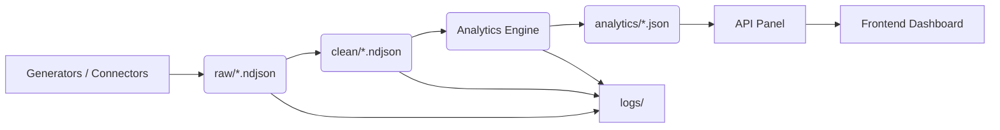

# MSME Lending Platform — Indian Financial Data Lake

Compliance-first data tooling for faster, smarter MSME lending decisions.

Why this project:
- **Faster credit decisions:** combine banking, GST, insurance, mutual funds and marketplace signals into one view.
- **Consent-first by design:** every request is scoped to a customer ID — no bulk processing, easier auditability.
- **Actionable insights, not just data:** automated summaries, explainable calculations and lending-ready outputs.
- **Built for reliability:** synthetic and reproducible data for development, with a clear path to real connector integration.

Top USPs (what makes us different)
- **Multi-source aggregation**: unified view across disparate Indian financial sources.
- **Developer-first DX**: drop-in generators, local frontend, and observability for quick demos.
- **AI-assisted reasoning**: provider-agnostic insight layer with graceful fallbacks.
- **Modular & auditable**: clear pipelines, JSON schemas, and logs for compliance and traceability.

Top features — quick
- Reproducible synthetic data per customer ID for consistent testing
- End-to-end pipeline: generate → clean → analyze → score
- Live debug & dataset viewer for rapid troubleshooting
- Lightweight API + frontend dashboard for demos and testing

**Architecture**
- **Generators**: produce reproducible synthetic `raw/*.ndjson` per customer (connectors for banks, OCEN, ONDC, GST, mutual funds, insurance). Generators live in `generators/` and `scripts/` for focused profiles.
- **Raw storage**: `raw/` contains original NDJSON exports (or connector outputs) keyed by customer IDs.
- **Cleaning pipeline**: `pipeline/clean_data.py` and helpers normalize, validate and write canonical records to `clean/`.
- **Analytics layer**: `analytics/generate_summaries.py` consumes cleaned data and selected raw inputs to produce `analytics/*.json` summaries (credit, GST, transactions, ONDC, OCEN, mutual funds, insurance, anomalies, overall score).
- **API & UI**: `api_panel/` exposes endpoints to fetch analytics and run pipeline steps; `frontend/` is a demo dashboard.
- **Observability & logs**: `logs/` contains parsing/cleaning traces and pipeline cache files for auditability.

**Data Flow & Workflow**
1. Generate (or ingest) raw data: connectors/generators write NDJSON to `raw/*` for a `customer_id`.
2. Clean: run `python pipeline/clean_data.py --customer-id <id>` to produce standardized records in `clean/*`.
3. Analyze: run `python analytics/generate_summaries.py --customer-id <id>` to create analytics JSON under `analytics/`.
4. Review & iterate: inspect `analytics/*_{customer_id}_*.json`, `clean/*`, and `logs/*` using the dataset viewer or CLI for quality checks.
5. Serve: the `api_panel` reads analytics JSON to return structured responses to the frontend/dashboard.

**Flowchart**
(Visual: use this mermaid snippet in supported renderers; ASCII fallback included.)



ASCII fallback:

Generators -> raw/ -> clean/ -> analytics/ -> api_panel -> frontend
                     \-> logs/ <-/ ^

**Operational Notes**
- Pipeline steps are idempotent and scoped by `customer_id` for consent-first operation and easy auditing.
- For demos we use synthetic generators; to move to production, swap generator modules for connector implementations and enable secure keying via `.env`.
- Some analytics fields are intentionally simulated in demo mode (see `analyze_credit`), while others are computed directly from cleaned raw sources (transactions, GST, ONDC orders, anomalies). Check `analytics/generate_summaries.py` for specifics and `logs/pipeline_cache` for pipeline traces.

---

## Standard README (detailed)

### Problem Statement

Traditional MSME lending faces long approval times, fragmented signals, and an urgent need to respect customer consent while aggregating multiple financial sources. This project demonstrates a pragmatic, developer-friendly approach to assembling those signals into lending-ready summaries.

### Quick Start

Prerequisites
- Python 3.11+
- Node.js 18+
- Git

1. Clone & setup
```bash
cd F:\\MSMELending\\data_lake
pip install -r requirements.txt
```

2. Add provider keys to `.env` (use your keys; do not commit secrets)
```bash
DEEPSEEK_API_KEY=your_deepseek_key
GEMINI_API_KEY=your_gemini_key
MAX_AI_PROMPT_TOKENS=1500
MAX_AI_RESPONSE_TOKENS=1500
```

3. Generate, clean, and analyze for a customer
```bash
python generate_all.py --customer-id CUST_MSM_00001
python pipeline/clean_data.py --customer-id CUST_MSM_00001
python analytics/generate_summaries.py --customer-id CUST_MSM_00001
```

4. Run the API
```bash
cd api_panel
python app.py
# Backend default: http://localhost:5000
```

5. Start the frontend
```bash
cd frontend
npm install
npm start
# Frontend default: http://localhost:3000
```

### Usage guide

Pipeline Monitor (recommended): use the UI to create a customer ID and run the four pipeline steps in order: generate → clean → analytics → score. For automated workflows, the same steps are available via CLI scripts.

Debugging
- Use the dataset viewer to compare `raw/` vs `clean/` files.
- Check `logs/` for validation and cleaning records.

### Testing

Example API checks
```bash
curl -X POST http://localhost:5000/api/pipeline/calculate_score \\
  -H "Content-Type: application/json" \\
  -d '{"customer_id":"CUST_MSM_00001"}'

curl "http://localhost:5000/api/analytics?customer_id=CUST_MSM_00001"
```

---

### Project layout

See the `data_lake` folder for generators, pipeline, analytics, API and frontend modules. The repo is organized for quick demos and iterative development.

### Configuration

Edit `config.json` to control scale and noise in generated data. Use `.env` for keys — never commit credentials.

### Known limitations & roadmap

Current
- Rule-based anomaly detection (first-pass)
- Partial parity in calculation metadata across some analyzers

Planned
- ML-based anomaly detection
- Full calculation metadata parity
- Real Account Aggregator integration

---

## Contributing

This is a demonstration-grade project. For production, replace synthetic connectors with real connectors, add authentication, audit trails, and deploy with secure infrastructure.

---

License: MIT

For questions or support, open an issue or contact the maintainers.
